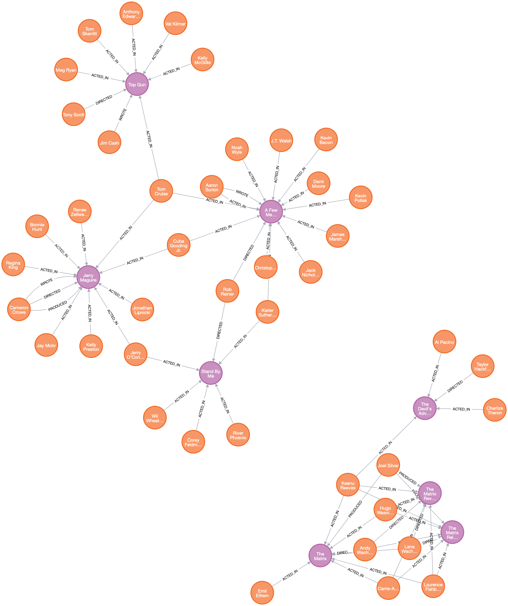

# README - MOOC Actions Data Analysis with Neo4j and Python

## Credentials

Full Name: Μιχαήλ Αγγελής 

ΑΜ: 8200001


## Project Overview

This project aims to load and analyze data pertaining to actions performed by users in a Massive Open Online Course (MOOC) platform. We use the Python library py2neo to connect with a Neo4j database and run Cypher queries. The data, consisting of user actions, action labels, and action features, is modeled as a graph in Neo4j.

## Data Description

The data is divided into three .tsv files:
1. **mooc_actions.tsv:** This file contains user action data. Each row represents an action performed by a user, identified by a USERID, on a target, identified by a TARGETID. Each action also has a unique ACTIONID and a TIMESTAMP.
2. **mooc_action_labels.tsv:** This file provides labels for the actions performed by users. Each row corresponds to an ACTIONID and its associated LABEL.
3. **mooc_action_features.tsv:** This file includes additional features for each action. Each row corresponds to an ACTIONID and its four associated features (FEATURE0, FEATURE1, FEATURE2, FEATURE3).

## Data Schema

The data is modeled as a graph with the following elements:
- `User`: Nodes representing users, identified by a `USERID`.
- `Target`: Nodes representing targets of user actions, identified by a `TARGETID`.
- `Action`: Relationships between `User` and `Target` nodes, with properties `ACTIONID`, `TIMESTAMP`, `LABEL`, and `FEATURES`.

## Python Script

The provided Python script connects to the Neo4j database and loads data from the .tsv files. The script creates the schema (Users, Targets, and Actions) and inserts data into the database.

Here's the script:

```python
from py2neo import Graph
import csv

if __name__ == '__main__':
    graph = Graph("bolt://localhost:7687", auth=("neo4j", "007clocky"))

    # Load moc_actions.tsv
    with open("mooc_actions.tsv", 'r') as data_file:
        csv_reader = csv.reader(data_file, delimiter='\t')
        header = next(csv_reader)  # skip the header
        for row in csv_reader:
            query = """
            MERGE (u:User {USERID: $USERID})
            MERGE (t:Target {TARGETID: $TARGETID})
            MERGE (u)-[a:Action {ACTIONID: $ACTIONID, TIMESTAMP: $TIMESTAMP}]->(t)
            """
            graph.run(query, USERID=row[2], TARGETID=row[1], ACTIONID=row[0], TIMESTAMP=row[3])

    # Load mooc_action_labels.tsv
    with open("mooc_action_labels.tsv", 'r') as data_file:
        csv_reader = csv.reader(data_file, delimiter='\t')
        header = next(csv_reader)  # skip the header
        for row in csv_reader:
            query = """
            MATCH ()-[a:Action {ACTIONID: $ACTIONID}]->()
            SET a.LABEL = $LABEL
            """
            graph.run(query, ACTIONID=row[0], LABEL=row[1])

    # Load mooc_action_features.tsv
    with open("mooc_action_features.tsv", 'r') as data_file:
        csv_reader = csv.reader(data_file, delimiter='\t')
        header = next(csv_reader)  # skip the header
        for row in csv_reader:
            query = """
            MATCH ()-[a:Action {ACTIONID: $ACTIONID}]->()
            SET a.FEATURE0 = $FEATURE0, a.FEATURE1 = $FEATURE1, a.FEATURE2 = $FEATURE2, a.FEATURE3 = $FEATURE3
            """
            graph.run(query, ACTIONID=row[0], FEATURE0=row[1], FEATURE1=row[2], FEATURE2=row[3], FEATURE3=row[4])
```
## Cypher Queries
With the data loaded into the Neo4j database, we can run several Cypher queries to analyze the data.
The results of which can be seen in json format in the directory results

1. Visualize a portion of the graph

`MATCH (n) RETURN n LIMIT 50`



2.Count the number of Users, Targets, and Actions

```
# Count of users
MATCH (u:User) 
RETURN count(u) as UserCount

# Count of targets
MATCH (t:Target) 
RETURN count(t) as TargetCount

# Count of actions
MATCH ()-[a:Action]->() 
RETURN count(a) as ActionCount
```

3. Retrieve Actions performed by a specific User

```commandline
MATCH (U:User {USERID: "4"})-[A:Action]->(T:Target)
RETURN U.USERID as UserID, A.ACTIONID as ActionID, T.TARGETID as TargetID
```

4. Count the number of Actions per User

```commandline
MATCH (U:User)-[A:Action]->()
RETURN U.USERID as UserID, count(A) as ActionCount
```

5. Count the number of unique Users per Target

```commandline
MATCH (U:User)-[:Action]->(T:Target)
RETURN T.TARGETID as TargetID, count(distinct U) as UserCount
```

6.Calculate the average number of Actions per User

```commandline
MATCH (u:User)-[a:Action]->()
WITH count(a) as totalActions, count(distinct u) as totalUsers
RETURN totalActions * 1.0 / totalUsers as AvgActionsPerUser
```

7.Retrieve Users and Targets where FEATURE2 of the Action is greater than 0


```commandline
MATCH (U:User)-[A:Action]->(T:Target)
WHERE A.FEATURE2 > "0"
RETURN U.USERID as UserID, T.TARGETID as TargetID
```

8.Count Actions with LABEL equal to 1 for each Target

```commandline

MATCH (T:Target)<-[A:Action]-()
WHERE A.LABEL = "1"
RETURN T.TARGETID as TargetID, count(A) as ActionCount
```

